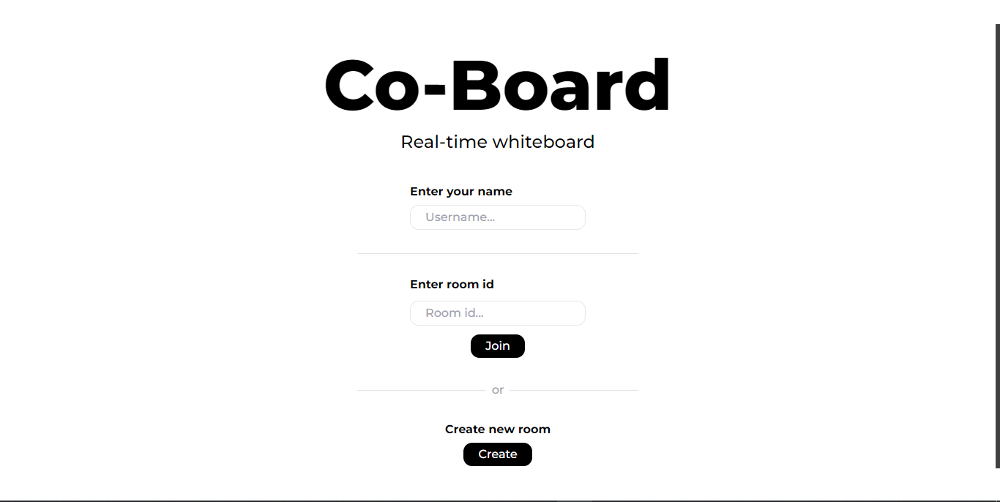

# Co-Board: A Dynamic Real-time Collaborative Whiteboard

Co-Board is an exhilarating real-time collaborative whiteboard application designed to foster creativity and teamwork. Crafted using TypeScript, React, Redux, and Socket.IO, Co-Board offers a captivating platform for users to seamlessly connect, brainstorm, and innovate together on a digital canvas.

## Features

- **Real-time Collaboration**: Experience the thrill of simultaneous collaboration as multiple users connect to the same whiteboard session and witness changes unfold in real-time.
- **User Authentication**: Dive into the action by logging in with your name, creating new rooms, or effortlessly joining existing ones using unique room IDs.
- **Customizable Whiteboard**: Unleash your imagination with an array of tools including pencils of various widths and vibrant colors. Dive deeper into discussions by seamlessly inserting images for brainstorming sessions.
- **Theme Selection**: Set the mood and ambiance with personalized themes, whether it's the pristine simplicity of a whiteboard or the nostalgic charm of a blackboard.
- **Interactive Chat Functionality**: Engage in lively discussions and exchange ideas in real-time with integrated chat functionality, fostering camaraderie and collaboration.

## Installation

1. Clone the repository:

   ```bash
   git clone https://github.com/yourusername/co-board.git
   ```

2. Install dependencies:

   ```bash
   cd co-board
   npm install
   ```

3. Start the development server:

   ```bash
   npm run dev
   ```

4. Open your web browser and navigate to `http://localhost:3000`.

## User Interface Screenshots




Add more screenshots to showcase the captivating user interface of Co-Board.

## Live Demo

Experience the magic of Co-Board firsthand by visiting our live demo [Click here](github.com/Kundan10424/Co-Board).

## Contributing

Contributions are always welcome! Feel the adrenaline rush as you contribute to the evolution of Co-Board. Open issues or submit pull requests for any improvements, bug fixes, or exhilarating new features.

